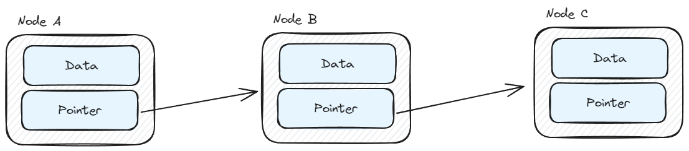
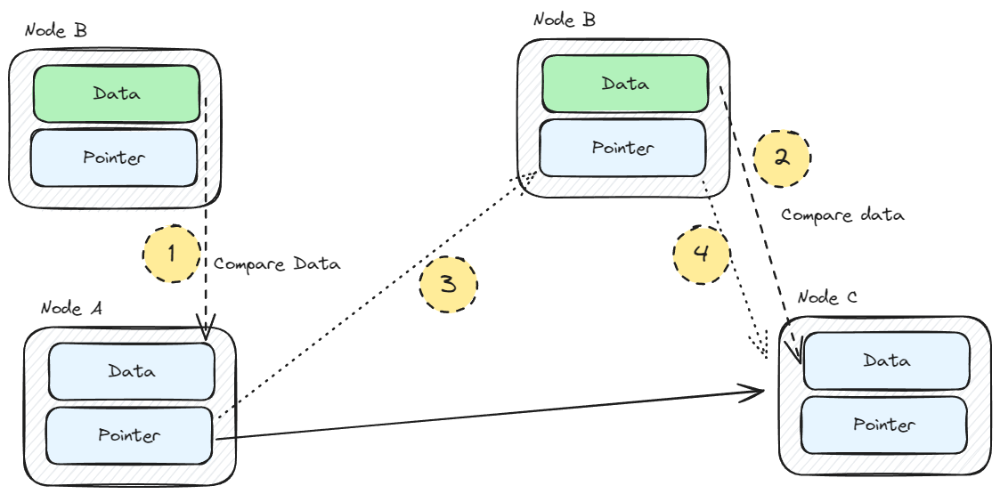
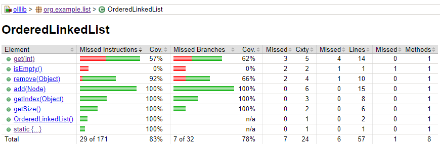

# Ordered Linked List implementation
## How it works
Basic element is _**NODE**_, represented by Data and Pointer.

**Data** = Actual data to be stored.
**Pointer** = Nullable reference for next node (link to next)

### Adding a new element

When adding element, following steps are done:
1. Compare data of inserted node with data of head node (if head is null, just insert it)
2. If comparison is false, move to next linked node (if exists, otherwise just insert and linked head to this)
3. If comparison is true, link previous node to current one
4. Set original node from comparison as next of inserted one.

## Coverage

## TODOS

- [ ] ASC/DESC types support
- [ ] Unit tests - Exceptions
- [ ] Rewrite alg description in README to something more human-readable :alien: